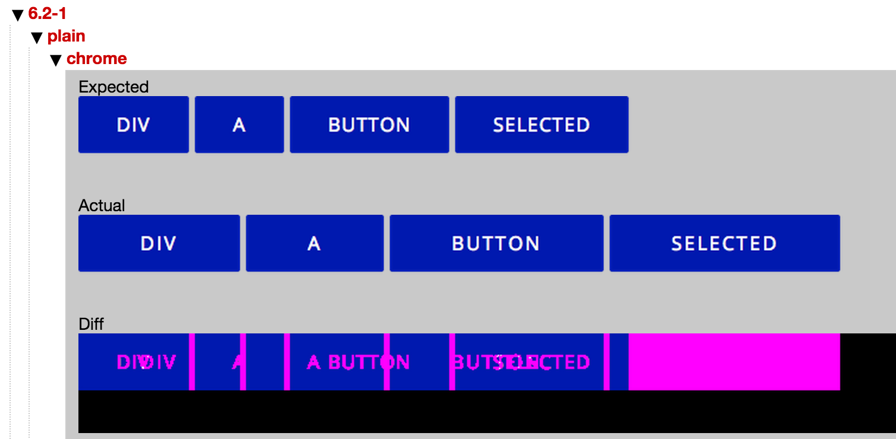
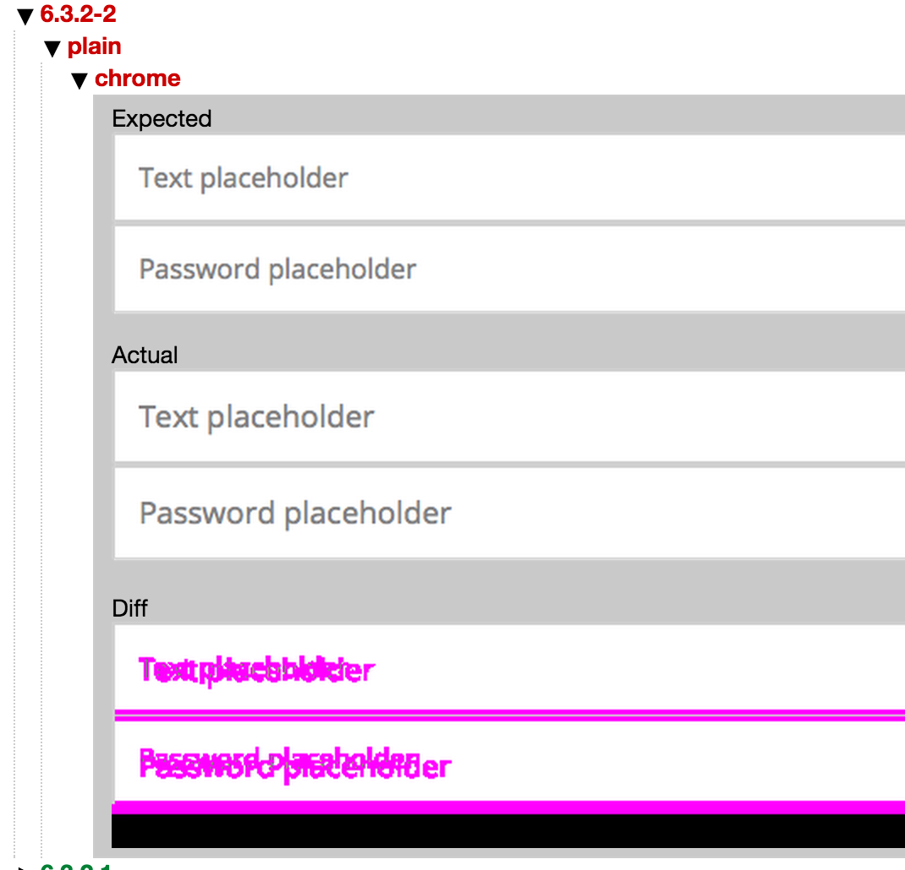
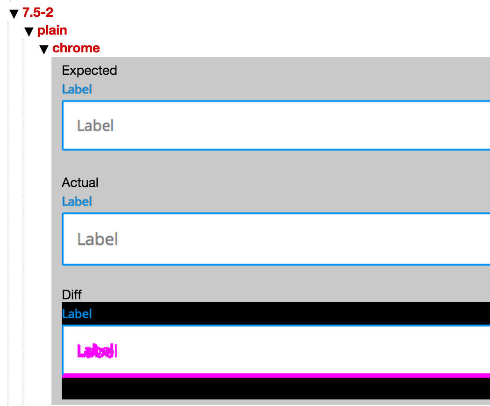

# sc5-styleguide-visualtest

A gulp plugin for automatic visual testing between different versions of components in SC5 StyleGuide.

The screenshots are taken in Chrome via PhantomJS.

## Technical requirements

You need to have PhantomJS installed. After that:

```
npm install --save-dev sc5-styleguide-visualtest
npm install --save-dev --save-exact gemini@0.12.6 #needed for tests
```

## Taking the grid screenshots
First you will need to create a set of grid images. They are usually taken from production version of the Style Guide.
It is nice to have a Gulp task for it because you will need to remake the grid screenshots after every interface change.

```js
var gulp = require("gulp");

var sc5StyleguideGemini = require('sc5-styleguide-visualtest');

gulp.task("test:visual:config", function() {
  gulp.src('path/to/styleguide/outpurDir', { read: false })
    .pipe(sc5StyleguideGemini.configure({
      excludePages: [
        '2.2.1', // Back icon is not shown in prod
        '6.1-2', // picture is not loaded in prod
      ]
    }))
    .pipe(gulp.dest('./tests/visual/config'))  // Path to configuration and tests
});

gulp.task("test:visual:update", ["test:visual:config"], function() {
  gulp.src('path/to/styleguide/outpurDir', { read: false })
    .pipe(sc5StyleguideGemini.gather({
      configDir: './tests/visual/config', // Path to configuration and tests
      gridScreenshotsDir: './tests/visual/grid-screenshots',
      rootUrl: 'http://mycompany.com/styleguide'
    }));
});
```

You may also use `localhost` version of Style Guide in `rootUrl` when taking screenshots. If so, make sure it runs.

These 2 tasks will create a basic configuration in `tests/visual/config` folder (you can change to any other path). In
this folder you will get:
* list of fullscreen pages of your components and their modifiers, excluding the listed
* basic test
* grid screenshots put into `tests/visual/grid-screenshots` (change to your path)

Store the configuration files and the screenshots in teh repository. But don't forget to exclude from npm and bower
package if you provide it.

## Running tests
Tests will compare the grid screenshots with the current view of your Style Guide.

```js
gulp.task("visual:test", function(done){
  gulp.src(styleGuidePath, { read: false })
    .pipe(sc5StyleguideGemini.test({
      configDir: './tests/visual/config',
      gridScreenshotsDir: './tests/visual/grid-screenshots',
      rootUrl: 'http://127.0.0.1:8000/#'
    }));
});
```

Don't forget to have the server with StyleGuide running.

After running `gulp visual:test` you will get output like this:

```
✓ 5.1-25 plain [chrome]
✓ 5.1-26 plain [chrome]
✓ 5.1-27 plain [chrome]
✓ 5.1-28 plain [chrome]
✘ 6.2-1 plain [chrome]
✘ 6.2-2 plain [chrome]
✘ 6.2-3 plain [chrome]
✘ 6.2-4 plain [chrome]
✘ 6.2-5 plain [chrome]
```
The numbers are the references of components in your StyleGuide.

You may see the failed tests visually if open `gemini-report/index.html`.

This is how different problems look when spotted:

**Wrong padding**



**Wrong font size**



**Wrong height**

